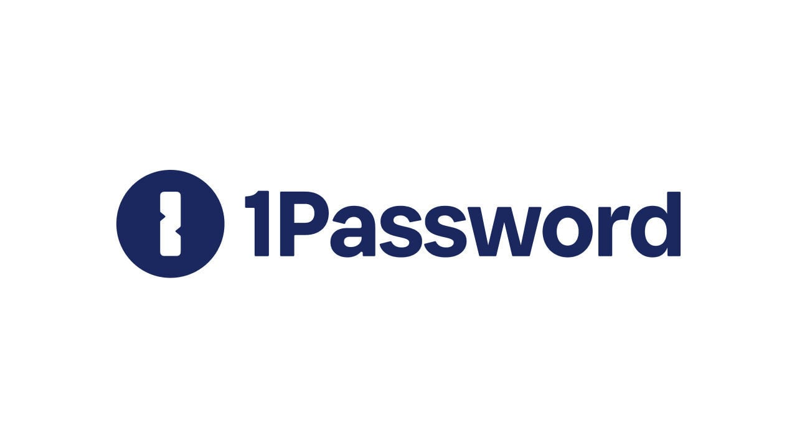

<div align="left">

[](https://1password.com)

# [1password](https://1password.com)

Trusted by more than 100,000 businesses to protect their data, 1Password gives you complete control over passwords and other sensitive business information. 

As an integral layer of the Identity and Access Management (IAM) stack, 1Password protects all employee accounts – even those you aren't aware of. Give employees secure access to any app or service and safely share everything you need to work together – including logins, documents, credit cards, and more – while keeping everything else private.

1Password is easy to deploy and integrates with Azure AD, Okta, OneLogin, and Slack, so you can automatically provision employees using the systems you already trust. It's simple to manage and fits seamlessly into your team's workflow, so you can secure your business without compromising productivity.

</div>

## Requirements

Building the API client library requires:

1. Java 1.8+
2. Maven (3.8.3+)/Gradle (7.2+)

If you are adding this library to an Android Application or Library:

3. Android 8.0+ (API Level 26+)

## Installation<a id="installation"></a>
<div align="center">
  <a href="https://konfigthis.com/sdk-sign-up?company=1Password&serviceName=Partnership&language=Java">
    
  </a>
</div>

### Maven users

Add this dependency to your project's POM:

```xml
<dependency>
  <groupId>com.konfigthis</groupId>
  <artifactId>1-password-partnership-java-sdk</artifactId>
  <version>2.0.0</version>
  <scope>compile</scope>
</dependency>
```

### Gradle users

Add this dependency to your `build.gradle`:

```groovy
// build.gradle
repositories {
  mavenCentral()
}

dependencies {
   implementation "com.konfigthis:1-password-partnership-java-sdk:2.0.0"
}
```

### Android users

Make sure your `build.gradle` file as a `minSdk` version of at least 26:
```groovy
// build.gradle
android {
    defaultConfig {
        minSdk 26
    }
}
```

Also make sure your library or application has internet permissions in your `AndroidManifest.xml`:

```xml
<!--AndroidManifest.xml-->
<?xml version="1.0" encoding="utf-8"?>
<manifest xmlns:android="http://schemas.android.com/apk/res/android"
    xmlns:tools="http://schemas.android.com/tools">
    <uses-permission android:name="android.permission.INTERNET"/>
</manifest>
```

### Others

At first generate the JAR by executing:

```shell
mvn clean package
```

Then manually install the following JARs:

* `target/1-password-partnership-java-sdk-2.0.0.jar`
* `target/lib/*.jar`

## Getting Started

Please follow the [installation](#installation) instruction and execute the following Java code:

```java
import com.konfigthis.client.ApiClient;
import com.konfigthis.client.ApiException;
import com.konfigthis.client.ApiResponse;
import com.konfigthis.client.OnePasswordPartnership;
import com.konfigthis.client.Configuration;
import com.konfigthis.client.auth.*;
import com.konfigthis.client.model.*;
import com.konfigthis.client.api.AccountApi;
import java.util.List;
import java.util.Map;
import java.util.UUID;

public class Example {
  public static void main(String[] args) {
    Configuration configuration = new Configuration();
    configuration.host = "https://billing.b5test.eu";
    
    // Configure HTTP bearer authorization: bearerAuth
    configuration.token = "BEARER TOKEN";
    OnePasswordPartnership client = new OnePasswordPartnership(configuration);
    String customerAccountUid = "customerAccountUid_example"; // A unique identifier for the end user's account to be provisioned. It can be up to 80 chars long and consist of alphanumeric characters and hyphens.
    String accountType = "accountType_example"; // Specifies the type of 1Password account plan to provision - 'I' for Individual, or 'F' for family.
    String domain = "domain_example"; // Specifies the 1Password domain to provision the account for. For testing it can be one of 'b5test.com', 'b5test.ca', or 'b5test.eu'. For production, it can be one of '1password.com', '1password.ca', or '1password.eu'. Note that domains can only be used after promotions have been created for a given partnership in the specific domain.
    OffsetDateTime endsAt = OffsetDateTime.now(); // Specifies when the 1Password account will be frozen, formatted in RFC-3339.
    try {
      Account result = client
              .account
              .beginProvisioningProcess(customerAccountUid, accountType, domain)
              .endsAt(endsAt)
              .execute();
      System.out.println(result);
      System.out.println(result.getCustomerAccountUid());
      System.out.println(result.getAccountType());
      System.out.println(result.getActivationToken());
      System.out.println(result.getDomain());
      System.out.println(result.getStatus());
      System.out.println(result.getDeployedMembers());
      System.out.println(result.getCreatedAt());
      System.out.println(result.getUpdatedAt());
      System.out.println(result.getEndsAt());
    } catch (ApiException e) {
      System.err.println("Exception when calling AccountApi#beginProvisioningProcess");
      System.err.println("Status code: " + e.getStatusCode());
      System.err.println("Reason: " + e.getResponseBody());
      System.err.println("Response headers: " + e.getResponseHeaders());
      e.printStackTrace();
    }

    // Use .executeWithHttpInfo() to retrieve HTTP Status Code, Headers and Request
    try {
      ApiResponse<Account> response = client
              .account
              .beginProvisioningProcess(customerAccountUid, accountType, domain)
              .endsAt(endsAt)
              .executeWithHttpInfo();
      System.out.println(response.getResponseBody());
      System.out.println(response.getResponseHeaders());
      System.out.println(response.getStatusCode());
      System.out.println(response.getRoundTripTime());
      System.out.println(response.getRequest());
    } catch (ApiException e) {
      System.err.println("Exception when calling AccountApi#beginProvisioningProcess");
      System.err.println("Status code: " + e.getStatusCode());
      System.err.println("Reason: " + e.getResponseBody());
      System.err.println("Response headers: " + e.getResponseHeaders());
      e.printStackTrace();
    }
  }
}

```

## Documentation for API Endpoints

All URIs are relative to *https://billing.b5test.eu*

Class | Method | HTTP request | Description
------------ | ------------- | ------------- | -------------
*AccountApi* | [**beginProvisioningProcess**](docs/AccountApi.md#beginProvisioningProcess) | **POST** /api/v1/partners/accounts | 
*AccountApi* | [**getByUid**](docs/AccountApi.md#getByUid) | **GET** /api/v1/partners/accounts/{customer_account_uid} | 
*AccountApi* | [**removeFromPartnership**](docs/AccountApi.md#removeFromPartnership) | **DELETE** /api/v1/partners/accounts/{customer_account_uid} | 
*AccountApi* | [**updateEndsAtByUid**](docs/AccountApi.md#updateEndsAtByUid) | **PATCH** /api/v1/partners/accounts/{customer_account_uid} | 


## Documentation for Models

 - [Account](docs/Account.md)
 - [CreatePartnerAccountRequest](docs/CreatePartnerAccountRequest.md)
 - [UpdatePartnerAccountRequest](docs/UpdatePartnerAccountRequest.md)


## Author
This Java package is automatically generated by [Konfig](https://konfigthis.com)
